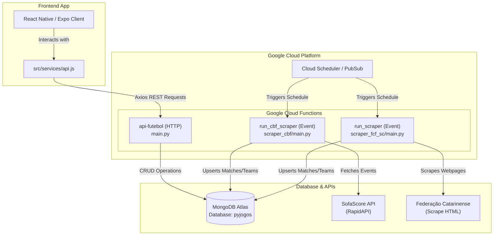

# Futebol SC - Frontend & Serverless Architecture

Welcome to the **Futebol SC** frontend application! This project is a premium, cross-platform mobile and web application built with **React Native (Expo)**. It is powered by a robust serverless backend consisting of several **Google Cloud Functions** and a **MongoDB** database.

This document serves as a complete technical guide to understanding how the frontend integrates with the serverless microservices, explaining the folder structure, API endpoints, data models, and the automation scrapers.

---

## 🏗️ System Architecture Overview

The application follows a modern serverless model:



---

## 📱 Frontend App (`frontend/`)

The user-facing portal is a highly visual, responsive **Expo (React Native)** application compiled for iOS, Android, and Web platforms.

### Key Folder Structure

*   `App.js`: The root component which controls the application state, manages font loading (Anton and Inter), and hosts the bottom tab navigation.
*   `src/components/`:
    *   `Header.js`: The styled custom application header.
    *   `MatchCard.js`: A premium, animated component that visually represents single match schedules, live status, logos, scores, stadiums, and location data.
*   `src/screens/`:
    *   `TeamsScreen.js`: Displays a list of soccer teams and supports filtering and selection.
    *   `TournamentsScreen.js`: Allows browsing of matches grouped by tournament names.
    *   `PremiumScreen.js`: Manages premium user profiles, plans, and customized favorite team selection.
    *   `AboutScreen.js`: Provides project background information.
*   `src/services/api.js`: The unified communication layer which dispatches requests to the remote Google Cloud Function.
*   `src/json/`: Houses offline fallback/mock files (`matches-today.json`, `teams.json`, etc.) used during local development.

### Development vs. Production Mode

In `frontend/src/services/api.js`, the app inspects the `EXPO_PUBLIC_ENVIRONMENT` environment variable:
*   **Development Mode (`dev`)**: Uses mock JSON files internally inside the app, avoiding API calls to GCP and reducing RapidAPI usage/costs.
*   **Production Mode**: Communicates directly with the deployed Cloud Run / Google Cloud Function endpoint: `https://api-futebol-qqpfwbjxua-rj.a.run.app`.

---

## ⚡ Google Cloud Functions (Serverless Backend)

Our backend runs completely serverless on **Google Cloud Functions (2nd Gen)** using the Python runtime (`python310`).

### 1. Backend REST API (`api-futebol`)
*   **Entry Point File**: `main.py` (in the root directory)
*   **GCP Function Entry Point**: `api_handler`
*   **Framework**: Flask + `functions_framework.http`
*   **Deployment Configuration** (`.deploymanual`):
    ```bash
    gcloud functions deploy api-futebol \
      --gen2 \
      --runtime=python310 \
      --region=southamerica-east1 \
      --source=. \
      --entry-point=api_handler \
      --trigger-http \
      --allow-unauthenticated \
      --set-env-vars MONGO_URI="..."
    ```

#### Endpoints Provided
All data endpoints are protected and require a valid token passed through the `x-access-token` header (unless using the `"development"` token bypass).

| Endpoint | Method | Auth Required | Description |
| :--- | :--- | :--- | :--- |
| `/` | `GET` | No | Base directory metadata, showing online status and endpoints list. |
| `/health` | `GET` | No | API health/ping test. |
| `/matches/today` | `GET` | Yes | Aggregates and sorts all soccer matches happening today across both FCF-SC and CBF. |
| `/matches/team/<name>` | `GET` | Yes | Retrieves scheduled/completed matches containing `<name>` as either the home or away team. |
| `/matches/tournament/<path>`| `GET` | Yes | Searches and retrieves matches belonging to a specific tournament. |
| `/tournaments` | `GET` | Yes | Returns a unique, sorted list of all active tournaments in the database. |
| `/teams` | `GET` | Yes | Returns a list of teams, optionally filtered by state (`?uf=SC`). Includes `sofascore_id` and `fcfsc_id` metadata. |
| `/user/verify` | `GET` | Yes | Authenticates user profiles. Auto-registers new emails with the default free plan (Plan `0`). |
| `/user/update-team` | `POST`| Yes | Binds a premium favorite team selection (`{name, sofascore_id, fcfsc_id}`) to a user profile. |

---

### 2. CBF SofaScore Scraper (`run_cbf_scraper`)
*   **Entry Point File**: `scraper_cbf/main.py`
*   **GCP Function Entry Point**: `run_cbf_scraper`
*   **Trigger**: `@functions_framework.cloud_event` (scheduled via Pub/Sub Cloud Scheduler)
*   **Frequency**: Daily cron configuration (with deep queries executing on specific weekdays).

#### Core Logic & Operations
1.  **Tournament Setup**: Executes bi-annually (June 1st and December 1st) to pull down lists of official tournaments from the SofaScore API.
2.  **Season Tracker**: Executes twice a season (December 20th and January 10th) to update season configuration files inside `scraper_cbf/json/` for active leagues.
3.  **Last Matches Sync**: Runs daily. Pulls down recently completed fixtures across the major CBF Series: **Série A, Série B, Série C, Série D, and Copa do Brasil**.
4.  **Upcoming Match Schedules**: Runs every Monday and Friday. Pulls future schedules and maps kickoff times to the database.
5.  **Team Profiles Integration**: Every processed event updates the shared `teams` collection, generating clean URLs for club badges:
    `https://api.sofascore.app/api/v1/team/{sofascore_id}/image`

---

### 3. FCF-SC BeautifulSoup Scraper (`run_scraper`)
*   **Entry Point File**: `scraper_fcf_sc/main.py`
*   **GCP Function Entry Point**: `run_scraper`
*   **Trigger**: `@functions_framework.cloud_event` (Cloud Scheduler)
*   **Frequency**: Configured to run periodically during active state competitions.

#### Core Logic & Operations
1.  **League Scrape Setup**: Crawls official competition tables provided on the **Federação Catarinense de Futebol** portal.
2.  **Competitions Crawled**:
    *   *Professional*: Campeonato Catarinense Série B.
    *   *Non-Professional / Youth*: Copa SC Sub-13, Sub-14, Sub-15, Sub-17, Sub-20, and Copa SC Feminina.
3.  **HTML Extraction**: Uses `BeautifulSoup4` to parse complex layouts. Translates dates, kickoff schedules, match IDs, stadiums, and location strings.
4.  **Scores & Logos Sync**: Isolates team names, matches them to standard database objects, and stores team logos from FCF's CDN.
5.  **Database Storage**: Saves findings to the `fcf_sc_YYYY` collections (where `YYYY` is the current year).

---

## 🗄️ Database & Collections Schema (MongoDB Atlas)

All microservices write to the `pyjogos` database inside MongoDB Atlas. The collections are organized as follows:

### 1. `cbf_YYYY` & `fcf_sc_YYYY` (Matches)
Contains documents representing soccer matches.

```json
{
  "_id": "ObjectId",
  "match_id": 123456,
  "tournament": "SÉRIE A 2026",
  "date": "15/06/2026",
  "schedule": "16:00",
  "homeTeam": "CRICIÚMA",
  "homeLogo": "https://api.sofascore.app/api/v1/team/1971/image",
  "homeScore": 2,
  "awayTeam": "CHAPECOENSE",
  "awayLogo": "https://api.sofascore.app/api/v1/team/1975/image",
  "awayScore": 1,
  "stadium": "Heriberto Hülse",
  "location": "Criciúma",
  "teams": ["CRICIÚMA", "CHAPECOENSE"],
  "timestamp": 1781548800,
  "uf": "SC"
}
```

### 2. `teams`
A lookup index mapping all active clubs to their asset badges, state origin, and external IDs.

```json
{
  "_id": "ObjectId",
  "name": "CRICIÚMA",
  "uf": "SC",
  "logo": "https://api.sofascore.app/api/v1/team/1971/image",
  "sofascore_id": 1971,
  "fcfsc_id": 12
}
```

### 3. `users`
Persists user profiles and their favorite club subscription details.

```json
{
  "_id": "ObjectId",
  "email": "user@example.com",
  "name": "John Doe",
  "avatar": "https://...",
  "start_date": "2026-06-08",
  "plan": 0,
  "selected_team": {
    "name": "CRICIÚMA",
    "sofascore_id": 1971,
    "fcfsc_id": 12
  },
  "created_at": "2026-06-08T14:00:00Z"
}
```

### 4. `tokens`
Houses valid active headers for secure communication with the backend.

```json
{
  "_id": "ObjectId",
  "token": "1305#Tricolouco69",
  "owner": "admin"
}
```

---

## 🛠️ Local Tools & Historical Database Scrapers (`meutimenarede/`)

In addition to the Cloud Function scrapers, the `meutimenarede/` directory contains specialized **local scripts** designed to crawl highly detailed, historic soccer stats from the "Meu Time na Rede" portal:

*   `scrap_jogos.py`: Deeply crawls matches, cataloging technical summaries (spectators, tickets sold, general earnings/revenues).
*   `scrap_this_match.py`: Extracts specific play-by-page events (coaches, cards, goals, substitutions, complete match lineups).
*   `scrap_atletas.py`: Compiles soccer player statistics and details.
*   `scrap_times.py`: Gathers basic club layouts.

---

## ⚙️ Environment Setup & Settings

### Frontend (`frontend/.env`)
Create a `.env` in the `frontend` folder containing:
```env
EXPO_PUBLIC_URL=https://api-futebol-qqpfwbjxua-rj.a.run.app
EXPO_PUBLIC_ENVIRONMENT=dev
```
*Note: Toggle `EXPO_PUBLIC_ENVIRONMENT=prod` to make calls directly to Google Cloud. Keep it as `dev` to use mock data.*

### Run Frontend Locally
To launch the Expo client:
```bash
cd frontend
npm install
npm run start
```
From the Expo menu, you can press `w` to run on the web browser, `a` for Android Emulator, or `i` for iOS Simulator.
